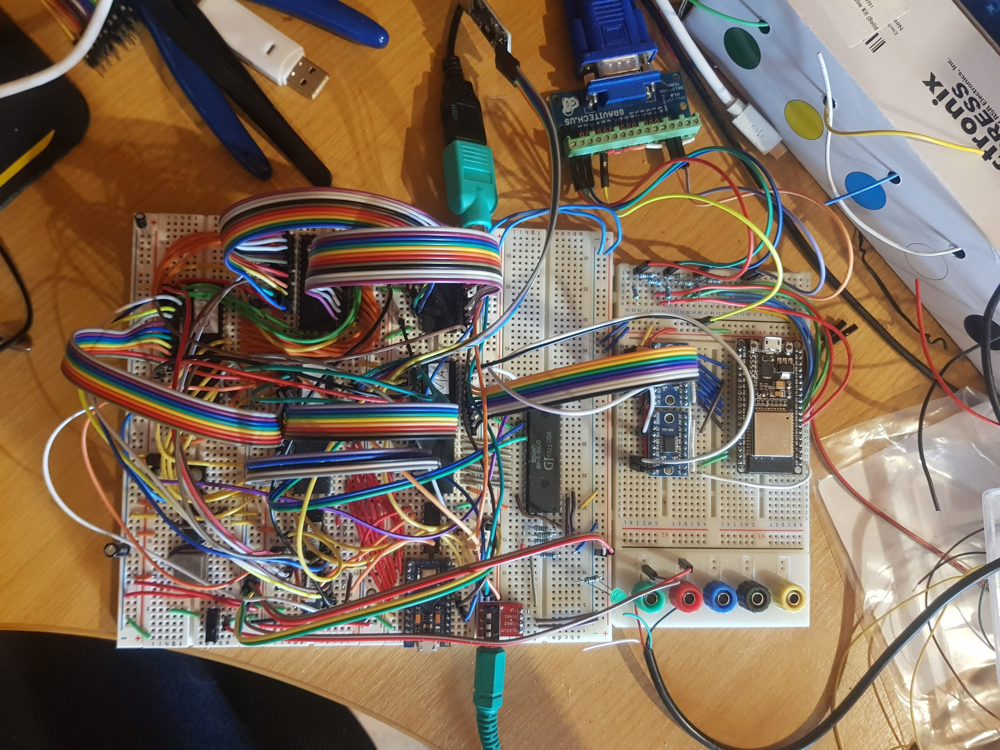
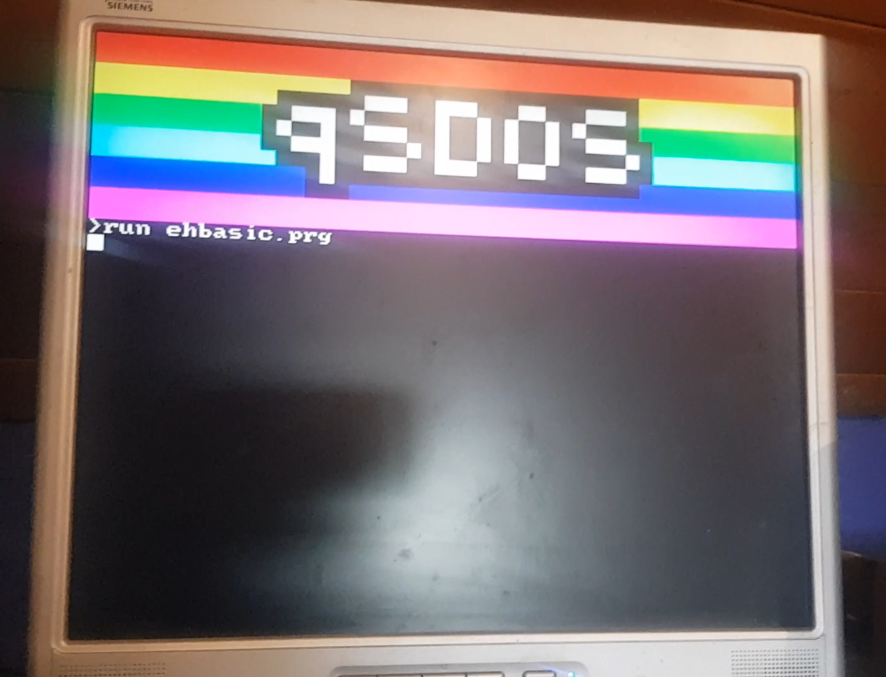

# 6502Computer
A custom 8-bit computer based on the 6502 CPU. Aims to recreate the home computer experience of the 1980s, with some modern features.

## Specs
- 65c02 CPU running at 2 or 4 MHz
- 32KiB RAM
- 16KiB ROM
- YM2149 / AY-3-8910 Sound Chip
- Custom Video System powered by [FabGL](https://github.com/fdivitto/fabgl)
- MicroSD slot
- PS/2 Keyboard Input
- Modular Design

## Pictures
<figure>
    
    <figcaption>Breadboard Prototype</figcaption>
</figure>
<figure>
    
    <figcaption>OS Running</figcaption>
</figure>